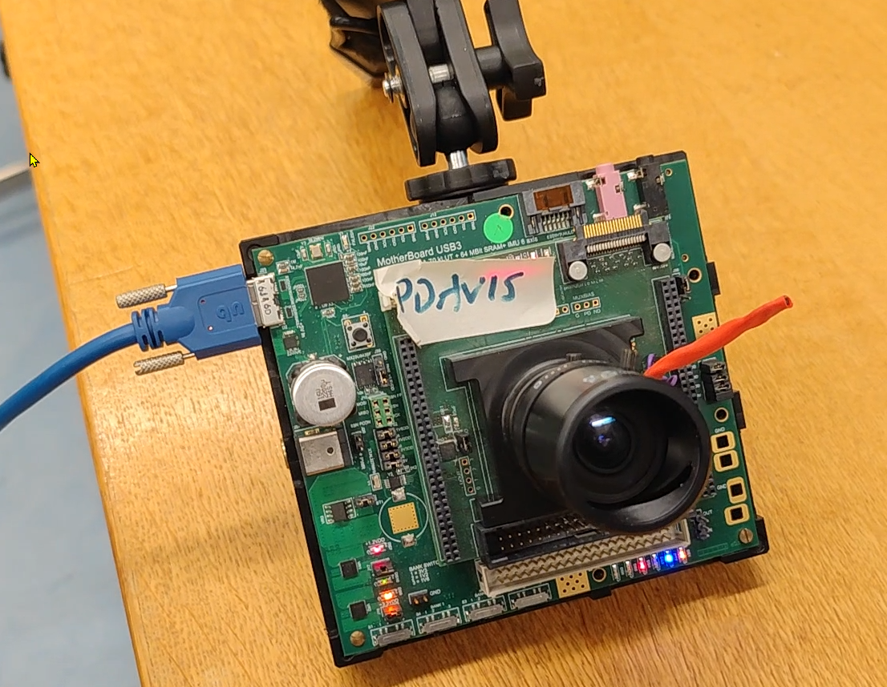
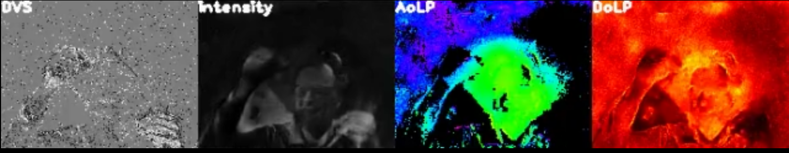

## Implementation of Events to Polarizartion (E2P) PDAVIS Live Demo

https://user-images.githubusercontent.com/10061874/229672133-e27f91fb-77d3-4ad0-91f4-b944a8af62b1.mp4

The subject first holds a single polarization filter, then pans around the room. Then finally a set of 3 triangular polarization filters arranged at 60 degree angles. The E2P input is DVS voxel volumes of 5 frames (the final one is rendered as DVS) and output is the E2P reconstructed intensity, angle, and degree of linear polarization.

- [Table of Contents](#implementation-of-pdavis-Live-demo)
  * [1. Introduction](#1-introduction)
  * [2. Requirements](#2-requirements)
  * [3. Run](#3-run)
  * [4. Results](#4-results)
    + [4.1. Saving Directory](#41-saving-directory)
  * [5. Citation](#5-citation)
  * [6. Contact](#6-contact)

### 1. Introduction

The polarization event camera PDAVIS is a novel bio-inspired neuromorphic vision sensor 
that outputs both conventional polarization frames and asynchronous, 
continuously per-pixel polarization brightness changes (polarization events) 
with **_fast temporal resolution_** and **_large dynamic range_**.

This project enables live demonstration of the E2P PDAVIS as illustrated below.

See subfolder [train](train) for training new and improved E2P DNNs.


### 2. Requirements
#### 2.1. Ubuntu
From terminal
* create virtual environement.  (Here we use virtualenv, but conda env works fine too.)
  ```
  mkvirtualenv pdavis_demo
  ```
* Python 3.8.10, CUDA 11.3, PyTorch == 1.11.0+cu113, TorchVision == 0.12.0+cu113
  ```
  workon pdavis_demo
  pip install torch==1.11.0+cu113 torchvision==0.12.0+cu113 torchaudio==0.11.0 --extra-index-url https://download.pytorch.org/whl/cu113
  ```
* install libcear. Building pyaer (below) will probably also require building [libcaer](https://gitlab.com/inivation/dv/libcaer/-/tree/master/) from source using a particular checkpoint as shown below.
  ```
  sudo apt-get update
  sudo apt-get install build-essential pkg-config libusb-1.0-0-dev
  git clone https://gitlab.com/inivation/dv/libcaer.git
  cd libcaer
  git checkout e68c3b4c115f59d5fd030fd44db12c702dddc3a5 # note you need this particular version
  sudo apt install cmake
  cmake -DCMAKE_INSTALL_PREFIX=/usr .
  make -j
  sudo make install
  ```
* Build [pyaer](https://github.com/duguyue100/pyaer/blob/master/INSTALL_FROM_SOURCE.md)from source (needed because pyaer master is broken at this time). 

* install other dependencies
  ```
  pip install -r requirements.txt
  ```
  
#### 2.2. Windows

We successfully run the PDAVIS demo on Windows 11 inside a WSL2 virtual Ubuntu 22 using [usbipd](https://github.com/dorssel/usbipd-win) to map the PDAVIS to WSL2.
* We use the handy Windows utility [wsl-usb-gui](https://gitlab.com/alelec/wsl-usb-gui) to control usbipd 
* We use the great Windows X server [https://sourceforge.net/projects/vcxsrv/](VcXsrv) to develop with pycharm and display the demo output to the Windows 11 desktop.
* VcXsrv needs to be set to disable access control

### 3. Run
 1. The pretrained polarization reconstruction model [e2p-0317_215454-e2p-paper_plus_tobi_office-from-scratch.pth](models%2Fe2p-0317_215454-e2p-paper_plus_tobi_office-from-scratch.pth) is in the _models_ folde.
 2. Connect hardware: PDAVIS to USB.

#### Using a single command to launch producer and consumer processes using python multiprocessing
In a terminal at root of project run
```bash
python -m pdavis_demo
```
Once the demo is running, you can control it via keystroke commands in the terminal windows and the separate DVS (producer) and reconstruction (consumer) windows. Type 'h' in the window to see help printed to terminal for available commands.

#### Using two terminals to run the producer (DAVIS) and consumer (E2P) processes

 1. In first terminal run producer 
    ```bash
    python -m producer 
    ```
 2. In a second terminal run consumer
    ```bash
    python -m consumer
    ```

### 4. Results

<p align="center">
    
    </br>
    <br />
    <em> 
    Figure 1: PDAVIS live demo: (top) PDAVIS camera and (bottom) polarization reconstruction results.
    </em>
</p>

#### 4.1. Saving Directory
The output files are automatically saved at the location specified by the variable _RECORDING_FOLDER_ in [globals_and_utils.py](globals_and_utils.py):

	./output
	├── xxx
	│   ├── xxx
    │   |   ├── xxx.png
    │   |   └── ...
	│   ├── xxx
    │   |   ├── xxx.png
    │   |   └── ...
    │   └── xxx
	├── xxx
	│   ├── xxx
    │   |   ├── xxx.png
    │   |   └── ...
	│   ├── xxx
    │   └── xxx
	└── xxx

## 5. Citation

If you find this project useful, please consider citing:

    
	@INPROCEEDINGS{Gruev2022-pdavis-cvprw,
	  title           = "{PDAVIS}: Division of focal plane asynchronous
			     polarization imager",
	  booktitle       = "{CVPRW} Workshop on Event Based Vision",
	  author          = "Gruev, Viktor and Haessig, Germain and Joubert, Damien and
			     Haque, Justin and Milde, Moritz and Delbruck, Tobi",
	  publisher       = "IEEE",
	  pages           = "(accepted)",
	  year            =  2023,
	  url             = "https://tub-rip.github.io/eventvision2023/",
	  keywords        = "event based camera; polarization camera; asynchronous
			     polarization camera;",
	  language        = "en",
	  conference      = "Polarization: Measurement, Analysis, and Remote Sensing XV",
	  location        = "Vancouver"
	}

    @INPROCEEDINGS{Delbruck2023-e2p-demo,
      title           = "Live Demo: {E2P--Events} to Polarization Reconstruction
                         from {PDAVIS} Events",
      booktitle       = "{CVPRW} Workshop on Event Based Vision",
      author          = "Delbruck, Tobi and Wang, Zuowen and Mei, Haiyang and
                         Haessig, Germain and Joubert, Damien and Haque, Justin and
                         Chen, Yingkai and Milde, Moritz B and Gruev, Viktor",
      publisher       = "IEEE",
      pages           = "(accepted)",
      year            =  2023,
      location        = "Vancouver"
    }

    @INPROCEEDINGS{Meil2023-e2p-cvpr,
      title           = "Deep Polarization Reconstruction with {PDAVIS} Events",
      booktitle       = "{CVPR}",
      author          = "Meil, Haiyang and Wang, Zuowen and Yang, Xin and Wei,
                         Xiaopeng and Delbruck, Tobi",
      publisher       = "IEEE",
      pages           = "(accepted)",
      year            =  2023,
      location        = "Vancouver"
    }

### 6. Contact

[Tobi Delbrück](https://www.ini.uzh.ch/~tobi/) (tobi@ini.uzh.ch)

[Haiyang Mei](https://mhaiyang.github.io/) (haiyang.mei@outlook.com)


**[⬆ back to top](#1-introduction)**
