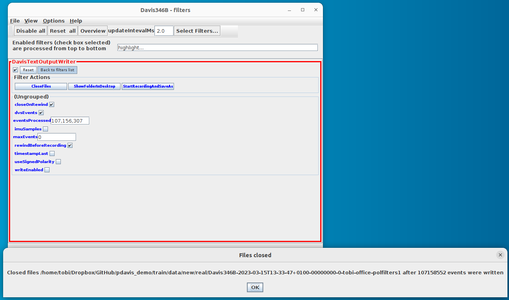
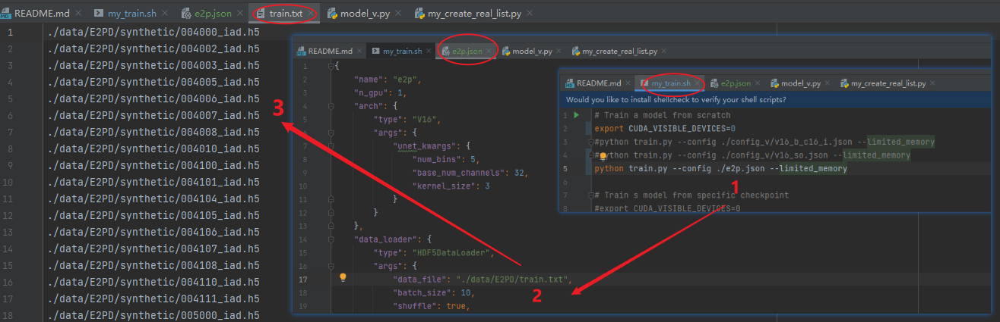

# Deep Polarization Reconstruction with PDAVIS Events
#### _INI_ 
#### _UZH / ETH Zurich_

### Local Experimental Environment
- Ubuntu 20.04.3 LTS
- NVIDIA GeForce RTX 3080 (10G Memory)
- NVIDIA-SMI = 470.94
- cuda = 11.3
- Python = 3.8.10
- torch-1.11.0+cu113 torchaudio-0.11.0+cu113 torchvision-0.12.0+cu113
- cv2 = 4.5.5
- numpy = 1.22.2
- pandas = 1.4.1
- h5py = 3.6.0

### 3090/V100 Server Environment Configuration
- Python 3.8.13
- PyTorch 1.12.0a0+8a1a93a
- `sudo docker pull nvcr.io/nvidia/pytorch:22.05-py3`
- `pip install -r requirements.txt`
- `apt-get update`
- `apt-get install libgl1`

### Using E2PD
Download E2PD from [ [Onedrive](https://1drv.ms/u/s!AjYBkUJACkBLm1tWpU-N0lmKv36x?e=oIEajs) ] or [ [Baidu Disk](https://pan.baidu.com/s/1JSZqcbFk_52Xd_Ex_bicmQ?pwd=e2pd), fetch code: e2pd ] and unzip it to ./data/ folder

- txt file location
  - ./data/E2PD/train.txt
  - ./data/E2PD/test.txt

- hdf5 file location
  - ./data/E2PD/synthetic/xxxxxx_iad.h5
  - ./data/E2PD/real/real-xx.h5

### Recording Data using PDAVIS
- Using PDAVIS with jAER to record aedat2 files and save them at ./data/new/real/
- extract PDAVIS frames with [my_extract_events.py](my_extract_events.py)
  - `python my_extract_aps.py`
- manually extract PDAVIS events from jaer using EventFilter DavisTextOutputWriter; see https://docs.google.com/document/d/1fb7VA8tdoxuYqZfrPfT46_wiT1isQZwTHgX8O22dJ0Q/#bookmark=id.9xld1vw3ttt0
  -  Set the options "rewindBeforeRecording" and "dvsEvents" and "closeOnRewind"
  - Click the "StartRecordingAndSaveAs" button and choose output file with .txt extension; you can select the ./data/new/real/...timecode.txt file and delete the timecode part.
    - (** Because of bug in DavisTextOutputWriter, it is essential to open the output xxx-events.txt and delete the first _n_ rows as they are duplicated. __n__ will be large number of perhaps 10k lines! **. If you don't do this you will get bogus timestamps that mess up the synchronization between events and frames and the training will have meaningless GT target.)
    - (** To find how many rows are duplicated, we can check the timestamp of the first frame in xxx-timecode.txt and then use this timestamp to find where the timestamp discontinuity appears in xxx-events.txt **)
    - 
- convert avi to frames with [my_video2frame.py](my_video2frame.py)
  - `python my_video2frame.py`
- merge events, frame, frame_idx, frame_ts, intensity, aolp, dolp into one hdf5 file for the use of DNN using [my_merge_h5.py](my_merge_h5.py)
  - `python my_merge_h5.py`
- create train/test list txt with [my_create_real_list.py](my_create_real_list.py)
  - `python my_create_real_list.py`

Now you should have the new list of training files to add to existing list

### Training input hdf5 files
The HDF5 (.h5) files should have the following contents

### Train
- `sh my_train.sh`

Steps are illustrated below. 

1. The main config is [e2p.json](e2p.json)
2.  It points to  [train.txt](data%2FE2PD%2Ftrain.txt) which lists the training input files.
3. These files must be at the locations listed in train.txt

### Test
- test e2p model
  - `python my_test.py`
- test firenet model
  - `python my_test_firenet.py`
- test e2vid model
  - `python my_test_e2vid.py`
- align e2p and firenet for visual comparison
  - `python align3_images.py`
- split the visual comparison results
  - `python split_visual3.py`
- output location
  - ./output_synthetic/e2p
  - ./output_real/e2p

### Evaluation
- obtain the ground truth from h5 file
  - `python utils/h5gt2iad.py`
- evaluation
  - `python eval.py`
- output location
  - ./txt_eval/e2p.txt

### Dataset Visualization
- `python utils/h5gt2iad.py`
- `python visualize_pvideo.py`
